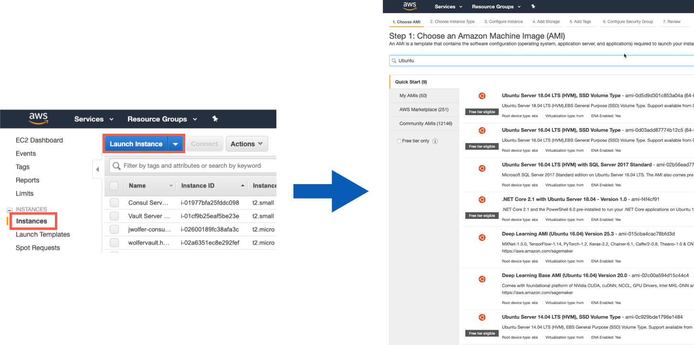
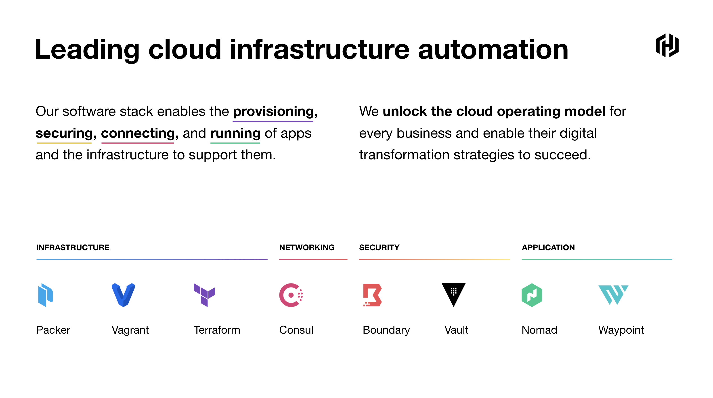
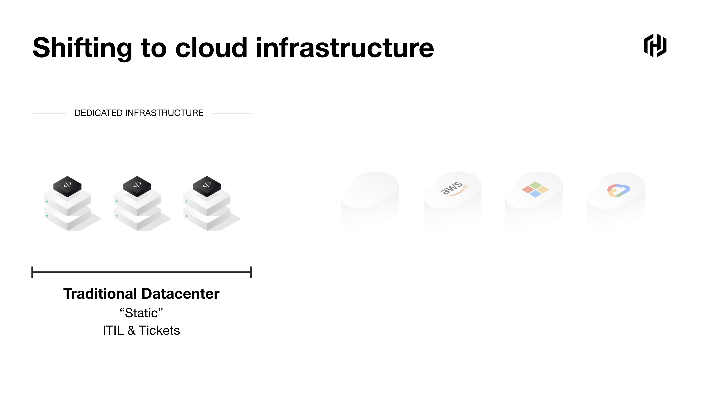
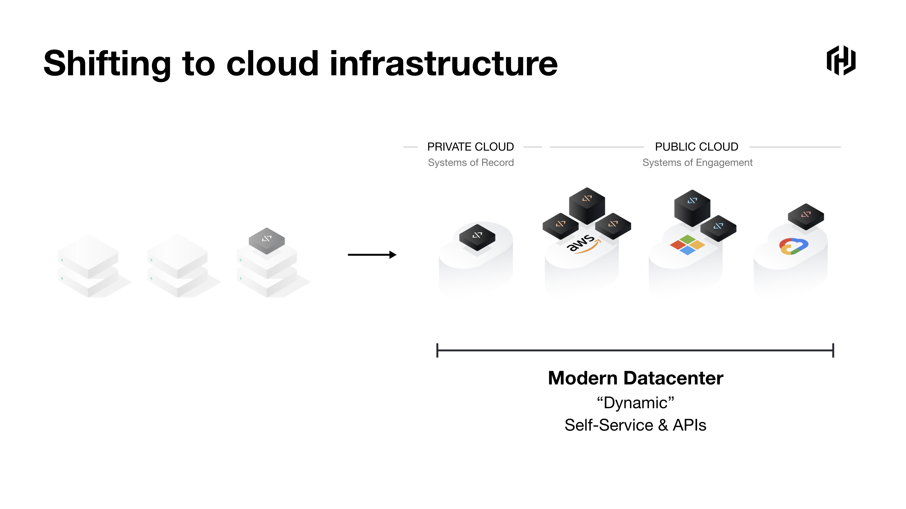
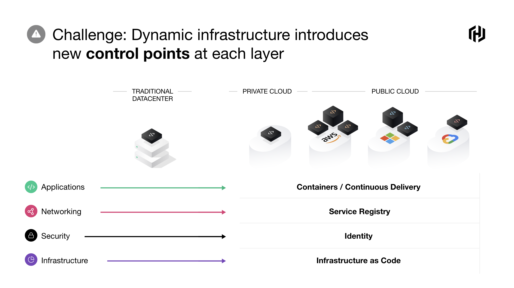
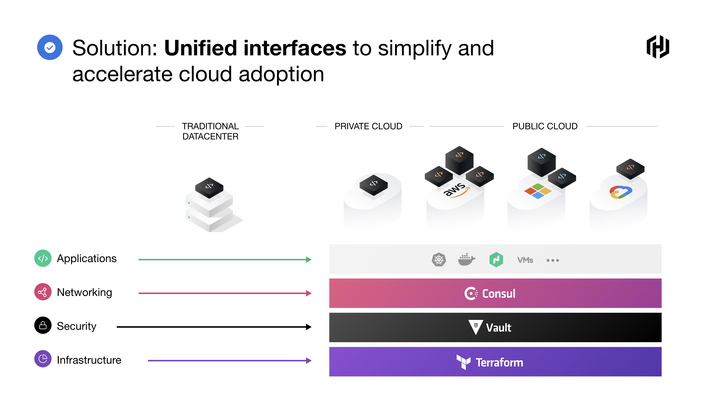
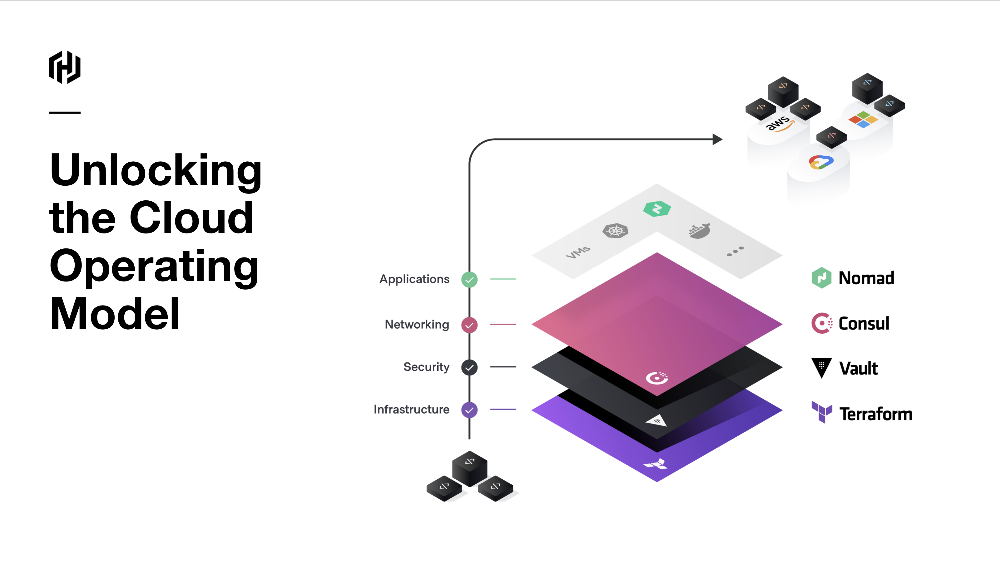
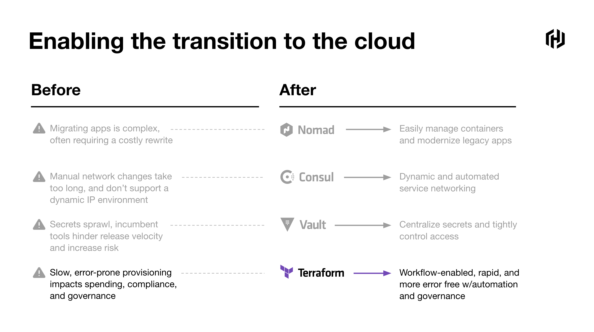

name: AWS-Terraform-Workshop
class: center
count: false

<br><br>
# AWS Terraform Workshop
## Build AWS Resources with Infrastructure as Code
???
INSTRUCTOR GUIDE LINK: https://github.com/hashicorp/field-workshops-terraform/blob/main/instructor-guides/aws_intro_to_terraform_INSTRUCTOR_GUIDE.md

This slide presentation is stored as Markdown code, specifically using the RemarkJS engine to render it. All standard markdown tags are supported, and you can also use some HTML within this document.

If you need to change the look and feel of the slide deck just use the style.css and remark_settings.js files to suit your needs. The content in this file is picked up by index.html when the page is loaded.

HTML comments like this one will show up in the source code, but not in the slides or speaker notes.
--->

Welcome to the beginner's guide to Terraform on AWS. This slide deck is written entirely in Markdown language, which means you can make edits or additions, then submit a pull request to add your changes to the main branch. To make edits to the slide deck simply fork this repository, edit the Markdown files, and submit a pull request with your changes.

The Markdown content is contained in the docs/ subdirectories.

Here are some helpful keyboard shortcuts for the instructor or participant:

⬆ ⬇ ⬅ ➡ - Navigate back and forth
P         - Toggle presenter view
C         - Pop an external window for presentation

Instructor notes are included in plain text, narrative parts are in **bold**. You can use the narrative quotes or change them to suit your own presentation style.

---
layout: true

.footer[
- Copyright © 2021 HashiCorp
- 
]

---
name: Introductions
# Introductions
Jay Aware
- Sr. Solutions Engineer, US Federal
- Splunk, NIH
- Favorite Text Editor: vi (can't figure out how to exit)

Greg Thomas | Federal SE

Ryan Wagner | Federal SE

???
Use this slide to introduce yourself, give a little bit of your background story, then go around the room and have all your participants introduce themselves.

The favorite text editor question is a good ice breaker, but perhaps more importantly it gives you an immediate gauge of how technical your users are.

**There are no wrong answers to this question. Unless you say Notepad. Friends don't let friends write code in Notepad.**

**If you don't have a favorite text editor, that's okay! Our cloud lab has Visual Studio Code preinstalled. VSC is a free programmer's text editor for Microsoft, and it has great Terraform support. Most of this workshop will be simply copying and pasting code, so if you're not a developer don't fret. Terraform is easy to learn and fun to work with.**

---
name: Link-to-Slide-Deck
# The Slide Deck
<br><br><br>
Follow along on your own computer at this link:

### <https://bit.ly/3B3qIyS>

---
name: Table-of-Contents
# Table of Contents

1. Intro to HashiCorp & Terraform
1. Terraform Basics<br>
👩‍🔬 **Lab - Setup and Basic Usage**
1. Terraform In Action: plan, apply, destroy
1. Organizing Your Terraform Code<br>
🧪 **Lab - Terraform in Action**<br>
1. Provision and Configure AWS Instances<br>
🔬 **Lab - Provisioning with Terraform**<br>
1. Manage and Change Infrastructure State<br>
1. Terraform Cloud<br>
⚗️ **Lab - Terraform Remote State**


???
This workshop should take roughly three hours to complete.

**Here is our agenda for today's training. The format is simple, you'll hear a lecture and view slides on each topic, then participate in a hands-on lab about that topic. We'll alternate between lecture and lab, with a couple of breaks thrown in.**

---
name: intro-to-terraform-demo
class: title
# Chapter 1
## Introduction to Terraform

???
We use the word chapter here, because the training should feel like a story unfolding. The instructor's job is to guide the learners through this interactive story.

---
name: How-to-Provision-an-AWS-Instance
# How to Provision an AWS Instance

Let's look at a few different ways you could provision a new AWS Instance. Before we start we'll need to gather some basic information including (but not limited to):

- Instance Name
- Operating System (Image)
- VM Size
- Geographical Location (Region)
- Security Groups

???
**Has anyone got experience using AWS? How do most of us normally get started? That's right, we log onto the AWS Console and start clicking around. All of the major cloud providers make this part really easy. You get your account, log on and start clicking buttons. Let's take a peek at what that looks like...**

We chose the AWS Console as a starting point because most AWS users will be familiar with it. From this familiar starting point we begin our journey...

---
name: AWS-Console-Provision
# Method 1: AWS Console (GUI)


???
**This should look familiar if you've ever used AWS. From the EC2 Panel, you click on Instances > Launch Instance, and you'll see a list of different AWS Machine Images (AMIs) you can use to provision your Instance. Some of these are provided by AWS, others are provided by third parties in the marketplace. You either search or browse for the thing you need, and click on it. Easy.**

---
name: AWS-Console-Provision-2
# Method 1: AWS Portal (GUI)


???
**Once you've chosen your AMI, you will fill in some more details - the instance type, the VPC you want it to launch in, any associated IAM roles you want to assign it, external storage, tags, security groups... it's a long list of options! The AWS console can be handy for spinning up individual VMs and dev or test environments. The good news is that it's really easy to spin up infrastructure this way. The bad news is that it doesn't scale, and chances are that nobody is keeping track of what got built.**

It's really easy to make a big mess of things if you simply give everyone a console account and turn them loose in the cloud environment.

---
name: CloudFormation-Templates
class: compact
# Method 2: CloudFormation Templates
```json
{
  "AWSTemplateFormatVersion" : "2010-09-09",

  "Description" : "AWS CloudFormation Sample Template EC2InstanceWithSecurityGroupSample: Create an Amazon EC2 instance running the Amazon Linux AMI. The AMI is chosen based on the region in which the stack is run. This example creates an EC2 security group for the instance to give you SSH access. **WARNING** This template creates an Amazon EC2 instance. You will be billed for the AWS resources used if you create a stack from this template.",

  "Parameters" : {
    "KeyName": {
      "Description" : "Name of an existing EC2 KeyPair to enable SSH access to the instance",
      "Type": "AWS::EC2::KeyPair::KeyName",
      "ConstraintDescription" : "must be the name of an existing EC2 KeyPair."
    },
  }
}
```

CloudFormation Templates provide a consistent and reliable way to provision AWS resources. JSON is easy for computers to read, but can be challenging for humans to edit and troubleshoot.

???
**Which brings us to method #2, CloudFormation Templates, also known as CFTs. Have any of you used CFTs? What's that experience like?**

**CFTs are written in JSON, which stands for JavaScript Object Notation. It is an open-standard format for transmitting data between computers. And don't get me wrong, JSON is great. If you happen to be a computer. Computers are really good at reading these files full of key-value pairs and lists.**

**The problem is that editing and maintaining huge JSON files is hard for humans. Because JSON is not a programming language, you'll end up writing a lot more lines of complex code that is hard to understand and change.**

**CloudFormation Templates - easy for computers to read, hard for humans to troubleshoot and maintain.**

We are not here to bash on CloudFormation Templates or any other JSON/YAML based provisioning tools. The simple fact is these data formats are not well suited for logical operations (if/then, for loops, etc.)

---
name: Provision-with-Terraform-2
# Method 3: Provision with Terraform
```terraform
resource aws_instance "web" {
  ami           = data.aws_ami.ubuntu.id
  instance_type = "t2.micro"

  tags = {
    Name = "HelloWorld"
  }
}
```
.center[Example Terraform code for building an AWS instance.]

???
**And finally we have option #3, Terraform. Terraform uses a Domain Specific Language, or DSL that is designed to be both human-friendly and machine-readable. This is an example snippet of Terraform code. Now watch as I flip back to the previous slide. Would you rather have to write and maintain this complex and messy JSON, or this simple, compact terraform code?**

Advance back to the previous slide to illustrate the difference between JSON and equivalent Terraform.

---
name: What-is-Terraform
# What is Terraform?
```terraform
resource aws_instance "catapp" {
  ami           = data.aws_ami.ubuntu.id
  instance_type = var.instance_type
  tags = {
    Name = "${var.prefix}-meow"
  }
```
* Executable Documentation
* Human and machine readable
* Easy to learn
* Test, share, re-use, automate
* Works on all major cloud providers


???
**So what exactly _is_ Terraform? Terraform is the DNA of your hybrid infrastructure. Terraform code is written in HCL, or HashiCorp Config Language. It is the only programming language designed specifically for provisioning infrastructure on any platform.**

**Do any of you have a wiki or set of runbooks that contain provisioning instructions? Think for a moment about that wiki. Now I want you to imagine the date stamp, when was this thing last edited? Let's say it was four years ago. Do you think maybe something could have changed in the past four years?**

**It sounds funny but the truth is your wiki is the obituary of the last known state of your infrastructure. One of the main reasons to use terraform is because it is self-documenting. The code itself explains every step required to build this infrastructure, and therefore it is always up to date.**

---
name: IaC
# What is Infrastructure as Code?
<br><br><br>
.biglist[
Infrastructure as Code (IaC) is the process of managing and provisioning cloud infrastructure with machine-readable definition files.

**Think of it as executable documentation.**
]

???
**You might be thinking...why can't I just do this by hand? After all the AWS portal is really easy, and I can just stand up my infrastructure manually. Here's why:**

**Terraform ensures that when you build any type of infrastructure that it gets built correctly every single time, exactly the same way. Let's try a thought experiment. If I gave every single one of you the same build document and asked you to set up a server, I guarantee there will be differences in those machines when you hand them over. They may not be major differences, but over time these can pile up and cause all sorts of uncertainty and issues in your environment.**

**When you require hands on keyboards (or mice), and you start making changes and manual steps on your infrastructure, you've lost the automation battle before it even starts. Even a single manual step can slow down your delivery schedule, and introduce unnecessary risk and change to your environments.**

---
name: IaC2
# Infrastructure as Code Allows Us To...
???
**We sometimes call this philosophy 'Infrastructure as Code', or the practice of expressing all of our provisioning steps as machine-readable code and variables. This is also known as the...**

---
name: IaC2
# Infrastructure as Code Allows Us To...
* Provide a codified workflow to create infrastructure
???
**...codified workflow. When you code-ify all of your manual steps, you'll gain several advantages that allow you to provision faster, with more efficiency, while reducing risk.**


---
name: IaC2
# Infrastructure as Code Allows Us To...
* Provide a codified workflow to create infrastructure
* Change and update existing infrastructure
???
**One of the main benefits of IaC is the ability to change and update what you built. There are many tools that allow you to provision infrastructure. This is sometimes called 'Day 0' of operations. The real challenge is managing Day N. What happens when you need to alter the infrastructure you built? Maybe you need to destroy or recreate part or all of it? Are you prepared to maintain and care for this infrastructure, without causing any downtime? Because Terraform is a _stateful_ tool, it can help you keep track of your infrastructure and change it with minimal impact.**

---
name: IaC2
# Infrastructure as Code Allows Us To...
* Provide a codified workflow to create infrastructure
* Change and update existing infrastructure
* Safely test changes using **`terraform plan`** in dry run mode
???
**Do you remember that scene in the movie Jurassic Park, where Samuel L Jackson turns around and says 'hold onto your butts' as he pushes his untested code change into production? Every sysadmin has had that feeling at one time or another. I really hope this works...**

**What if instead we had a way to safely test every change that went into production with a dry run? What would actually happen if I ran this code right now? Terraform comes with a built in dry run mode that allows you to visualize exactly what would happen if you pushed the apply button right now. This is a valuable tool for sysadmins and operations teams who prize stability and uptime.**

**Unexpected changes in the terraform plan output can be investigated _before_ they go into production.**

---
name: IaC2
# Infrastructure as Code Allows Us To...
* Provide a codified workflow to create infrastructure
* Change and update existing infrastructure
* Safely test changes using **`terraform plan`** in dry run mode
* Integrate with application code workflows (Git, CI/CD tools)

???
**Terraform allows you to automate manual processes and build continuous integration or continuous delivery pipelines. Imagine you had a pipeline for creating hardened machine images. Perhaps you have another pipeline for testing your infrastructure build process. These might be chained to other CI/CD application pipelines where the application is deployed into your tested, hardened infrastructure. Think of API driven infrastructure builds, written in a simple langage everybody can use and understand.**

---
name: IaC2
# Infrastructure as Code Allows Us To...
* Provide a codified workflow to create infrastructure
* Change and update existing infrastructure
* Safely test changes using **`terraform plan`** in dry run mode
* Integrate with application code workflows (Git, CI/CD tools)
* Provide reusable modules for easy sharing and collaboration

???
**As you expand your terraform usage, you'll have certain patterns and pieces of your infrastructure that you'd like to re-use. Maybe you want your network security to be set up a certain way, every time. Or perhaps someone wrote a great Terraform config for your web application. Terraform supports custom modules, which are simply packages of pre-built Terraform code that others can use. You can use Terraform modules to avoid repetition, enforce security, and ensure that standards are followed.**

---
name: IaC2
# Infrastructure as Code Allows Us To...
* Provide a codified workflow to create infrastructure
* Change and update existing infrastructure
* Safely test changes using **`terraform plan`** in dry run mode
* Integrate with application code workflows (Git, CI/CD tools)
* Provide reusable modules for easy sharing and collaboration
* Enforce security policy and organizational standards

???
**Terraform Enterprise also supports policy enforcement. You can create a list of dos and do-nots for your users and ensure that people don't build things they shouldn't, or introduce unnecessary risk into your environments. For example, you may have a policy that states that servers should not be exposed to the public internet. Because all your infrastructure is stored as code, you can quickly analyze that code to see if it's breaking any of the rules, preventing the bad behavior *before* the infrastructure gets built.**

---
name: IaC2
# Infrastructure as Code Allows Us To...
* Provide a codified workflow to create infrastructure
* Change and update existing infrastructure
* Safely test changes using **`terraform plan`** in dry run mode
* Integrate with application code workflows (Git, CI/CD tools)
* Provide reusable modules for easy sharing and collaboration
* Enforce security policy and organizational standards
* Enable collaboration between different teams

???
**Now that all your infrastructure is stored in a source code repository, it's very easy for multiple users and teams to collaborate on it. Developer needs a new feature? He or she can easily adjust the source code and send the change back to the operations folks for review. Terraform is a universal language that is understood by both developers and operations teams.**

---
name: IaC-Tools
# Other Infrastructure as Code Tools
.center[]

These tools work well for configuring the operating system and application. They are not purpose-built for provisioning cloud infrastructure and platform services.

???
**Some of you might be thinking, that sounds great but what about this other tool that I use? Why shouldn't I just use Ansible since we already have that? Or my people only do Powershell. These are all great tools. But none of them are specifically designed for provisioning tasks.**

**Chef, Puppet and Ansible all work great in the context of your operating system and applications. It's true that you can do some cloud provisioning with each of these tools, but none of them really work as well as Terraform. And conversely, HashiCorp doesn't have a configuration management tool. Terraform works great with all of these tools.**

---
name: Native-Tools
# Native Cloud Provisioning Tools
.center[]

Each cloud has its own YAML or JSON based provisioning tool.

Terraform can be used across *all* major cloud providers and VM hypervisors.

???
**Every major cloud provider has their own JSON or YAML based provisioning tool. But all of them are written in YAML or JSON. And if you learn one of these systems, guess what, the others are completely different. Now if you want to have a multi-cloud strategy you have to learn three separate provisioning systems. With Terraform you are using the same language, the same simple syntax on all three of these cloud providers.**

---
name: Config-Hell
.center[]
???
**This is a fun web comic. Those of you who have spent hours poking at a nested JSON template, trying to figure out which layer of curly braces you are in will understand this...**

---
Name: Terraform-vs-JSON
# Terraform vs. JSON
CFT JSON:
```json
"name": "{ "Fn::Join" : [ "-", [ PilotServerName, vm ] ] }",
```

Terraform:
```hcl
name = "${var.PilotServerName}-vm"
```

Terraform code (HCL) is easy to learn and easy to read. It is also 50-70% more compact than an equivalent JSON configuration.

---
Name: Why-Terraform-1
# Why Terraform?
.center[]

.center[### <https://blog.1password.com/terraforming-1password/>]

???
1Password did a great blog post illustrating the difference between AWS Cloudformation (JSON) and Terraform.

https://blog.1password.com/terraforming-1password/

1Password were able to move their entire production infrastructure to Terraform in a few short weeks. Now they can tear down and completely rebuild their production environment in a matter of hours.

---
Name: Why-Terraform-on-AWS
# Why Terraform on AWS?

* Supports multi-cloud & hybrid infrastructure

???
**Why specifcially should you use Terraform on AWS? The first reason is that Terraform supports your hybrid or multi-cloud strategy. If you need to build some infrastructure on-prem, and some in AWS, Terraform is a natural fit. Your technical staff only has to learn a single language to be able to provision in either environment.**

---
Name: Why-Terraform-on-AWS
# Why Terraform on AWS?

* Supports multi-cloud & hybrid infrastructure
* Migrate from other cloud providers

???
**Terraform is also great for migrating between cloud providers. Let's say you wanted to move some workloads from AWS to AWS. The code changes in Terraform would be much easier to implement than they would via CloudFormation Templates. I was able to migrate a simple demo application from one cloud to another in a few short hours, because there was almost no learning curve. Terraform code looks the same no matter where you run it.**

---
Name: Why-Terraform-on-AWS
# Why Terraform on AWS?

* Supports multi-cloud & hybrid infrastructure
* Migrate from other cloud providers
* Increase provisioning speed

???
**It's not unusual to see provisioning times drop from days or weeks to hours or minutes when users adopt Terraform. Ineffective manual steps and change approvals can be replaced with fast code pipelines that have rigorous testing and security built right in. Now instead of waiting for days for a change request to be approved, users can self-provision their infrastructure without bottlenecks or slow approval processes.**

---
Name: Why-Terraform-on-AWS
# Why Terraform on AWS?

* Supports multi-cloud & hybrid infrastructure
* Migrate from other cloud providers
* Increase provisioning speed
* Improve efficiency

???
**Have you heard the saying 'measure twice, cut once?'? Terraform forces your operations teams to be disciplined and consistent with every single build. Have a change or setting that was overlooked during the build? Now you can immediately correct that mistake inside the code, so that a particular step never gets missed again. All future builds will contain the change. This can also improve relations between developers and operations, because the contract is clear. What gets built is always defined in the code, and never left to guesswork or manual processes.**

---
Name: Why-Terraform-on-AWS
# Why Terraform on AWS?

* Supports multi-cloud & hybrid infrastructure
* Migrate from other cloud providers
* Increase provisioning speed
* Improve efficiency
* Reduce risk

???
**Every modern IT organization has to deal with risk. It's a balancing act between security and usability. You can make it so secure nobody can use it, or on the other end you have a free for all where users can do whatever they want, but are putting the entire cloud account in jeopardy due to risky behavior. Terraform allows you to reduce risk by abstracting your users away from the web UI or API. Instead we provide a safe, auditable abstraction layer that lets users get their work done in a secure and safe way, that doesn't grant unnecessary privileged access.**

---
name: HashiCorp-Intro0
class: title
# Great, but who are you?

???
**So, who is HashiCorp?**

---
name: HashiCorp-Intro1
# HashiCorp Intro
.center[]

???
**We build tools for practitioners, and these are used extensively. There’s a good chance engineers at your company use our tools today; many of these projects have been downloaded millions of times. They are foundational tools for the most important workflows for organizations large and small.**

---
name: HashiCorp-Intro2
.center[]

???
**What is the Cloud Operating Model? To understand that, we have to step back a bit and talk about this generational shift in computing.**

---
name: HashiCorp-Intro3
.center[]

???
**Your applications - systems of record running on-prem, and systems of engagement running in elastic public clouds - are now running on dynamic infrastructure. These clouds support a rapid pace of change, which is fantastic for innovation. This shift is happening everywhere. And as organizations dig in to this shift, things are even more complicated in a multi-cloud world.**

---
name: HashiCorp-Intro4
.center[]

???
**Provision: each has a unique tool to provision fleets of any size on-demand**

??? **Secure: each has a distinct IDENTITY model**
??? **Connect: each has a proprietary networking model which has given rise to the need for Service-based overlay models**
??? **Run: they all have multiple offerings here. Container-based offerings are key, but they also all are investing heavily in emerging concepts such as Serverless which represent the logical evolution at that layer.**
??? **The challenge then for any enterprise Ops and Security team is: how do I reconcile this reality?**

---
name: HashiCorp-Intro5
.center[]

???
**There’s a bit more to the picture too. Each cloud may be different, but they do all have one thing in common: they support a new control point at each layer.**
???
**This just underscores how architectures are different in a dynamic world.**

??? **Instead of monolith apps deploying to a web server every few months, you have containers delivered continuously.**
??? **Networking now revolves around loosely coupled services, and a service registry is the foundation for modern cloud networking.**
??? **Security is now about “who” you are, not “where” you are.**
??? **And Infrastructure as code enables the rapid provisioning and automation that supports everything above it.**

??? **How can you account for the differences in APIs with the similarity in control point? That’s exactly what HashiCorp has done.**

---
name: HashiCorp-Intro6
.center[]

???
**So, How do you interface with multi-cloud infrastructure with consistency? You establish central shared service platform with a single control plane.**

??? **Your goal should be to establish a central shared service platform with a single control plane, across all four of these layers.**
??? **What’s happening is each cloud infrastructure has a different API for each of these four layers. Different technologies native to each island of compute.**

??? **Which brings us to the Cloud Operating Model.**


**

---
name: HashiCorp-Intro7
.center[]

???
**It's really an approach to enable all of your teams to run provisioning, security, networking, and runtime through a single control plane at every layer. This approach helps all of your developers and practitioners to be more productive, and it connects them in meaningful ways to the cloud that matter.**

---
name: HashiCorp-Intro8
.center[]

???
**But let's focus on the major scenarios we can help with. Let’s start at the bottom and work up.**

??? **Terraform provides the foundation for cloud infrastructure automation using infrastructure-as-code for provisioning and compliance in the cloud operating model**

??? **Vault: In the traditional high-trust model, a requestor or application makes the request of a backend system and would give the credentials required to get the data. This is how the vast majority of high profile security breaches have occurred. In the cloud, we need a low or zero trust network. Vault intelligently acts as an intermediary to tightly control access to secrets & systems**

??? **Consul:**

??? **Nomad: allows organizations to keep a single workflow before, during and after their application & workload migration journey. Nomad can orchestrate existing infrastructure without the need to force containerization or rewrite them**

---
name: HashiCorp-Intro9
.center[]

???
**The Cloud Operating Model is a fantastic way to unify many different parts of your cloud strategy. And that's exactly what we're going to focus on today: How to simplify cloud infrastructure deployments with Terraform**

---


name: Chapter-2
class: title
# Chapter 2
## Terraform Basics

???
**Now that you have terraform installed and working with AWS, we can do a few dry runs before building real infrastructure. Follow along carefully, copying and pasting the commands on each slide into your shell as we go.**

---
name: what-is-terraform-oss
class: img-left
# What is Terraform?


Terraform is a provisioning tool.

It ships as a single binary which is written in Go. Terraform is cross platform and can run on Linux, Windows, or MacOS.

Installing Terraform is easy. You simply download a zip file, unzip it, and run it.

---
name: terraform-command-line
class: col-2
# Terraform Command Line
Terraform is a command line tool.

Terraform commands are either typed in manually or run automatically from a script.

The commands are the same whether you are on Linux or Windows or MacOS.

Terraform has subcommands that perform different actions.

```terraform
# Basic Terraform Commands
terraform version
terraform help
terraform init
terraform plan
terraform apply
terraform destroy
```

---
name: terraform-help
# Terraform Help
```tex
*$ terraform help
Usage: terraform [-version] [-help] <command> [args]
...
Common commands:
    apply              Builds or changes infrastructure
    console            Interactive console for Terraform interpolations
    destroy            Destroy Terraform-managed infrastructure
    env                Workspace management
    fmt                Rewrites config files to canonical format
    graph              Create a visual graph of Terraform resources
```
Type `terraform subcommand help` to view help on a particular subcommand.
???
**This is a good command to know. Terraform help will reveal all the available subcommands.**

---
name: terraform-code
# Terraform Code
```terraform
resource aws_vpc "main" {
  cidr_block       = "10.0.0.0/16"
  instance_tenancy = "dedicated"
}
```

Terraform code is based on the [HCL2 toolkit](https://github.com/hashicorp/hcl). HCL stands for HashiCorp Configuration Language.

Terraform code, or simply *terraform* is a declarative language that is specifically designed for provisioning infrastructure on any cloud or platform.

---
name: main.tf
# Terraform Comments
Line Comments begin with an octothorpe<sup>*</sup>, or pound symbol: #
```hcl
# This is a line comment.
```

Block comments are contained between /\* and \*/ symbols.
```tex
/* This is a block comment.
Block comments can span multiple lines.
The comment ends with this symbol: */
```
.small[
\* Yes, it really is called an [octothorpe](https://www.merriam-webster.com/dictionary/octothorpe).
]

---
name: terraform-workspaces
# Terraform Workspaces

A terraform workspace is simply a folder or directory that contains terraform code.

Terraform files always end in either a `*.tf` or `*.tfvars` extension.

Most terraform workspaces contain a minimum of three files:

**main.tf** - Most of your functional code will go here.<br>
**variables.tf** - This file is for storing variables.<br>
**outputs.tf** - Define what is shown at the end of a terraform run.<br>

---
name: terraform-init
# Terraform Init
```tex
*$ terraform init

Initializing provider plugins...
- Checking for available provider plugins...
- Downloading plugin for provider "aws" (hashicorp/aws) 2.35.0...
...
 provider.aws: version = "~> 2.35"

Terraform has been successfully initialized!

```
Terraform fetches any required providers and modules and stores them in the .terraform directory. If you add, change or update your modules or providers you will need to run init again.

???
**Terraform has an extendible architecture. You download the core program, terraform, then it fetches plugins and modules that are required for your code.**

---
name: terraform-plan
# Terraform Plan
```tex
*$ terraform plan
An execution plan has been generated and is shown below.
Terraform will perform the following actions:
  # aws_vpc.main will be created
  + resource "aws_vpc" "main" {
      + arn                              = (known after apply)
      + cidr_block                       = "10.0.0.0/16"
      ...
      + instance_tenancy                 = "dedicated"
    }
```
Preview your changes with `terraform plan` before you apply them.

???
**`terraform plan` is a dry run command. We're not actually building anything yet, Terraform is just telling is what it would do if we ran it for real.**

---
name: defining-variables
# Where are Variables Defined?
Terraform variables are placed in a file called *variables.tf*. Variables can have default settings. If you omit the default, the user will be prompted to enter a value. Here we are *declaring* the variables that we intend to use.

```tex
variable "prefix" {
  description = "This prefix will be included in the name of most resources."
}

variable "instance_tenancy" {
  description = "A tenancy option for instances launched into the VPC."
* default     = "dedicated"
}
```

???
**If you're curious where all these variables are defined, you can see them all in the _variables.tf_ file. Here we are simply defining all the available settings, and optionally declaring some default values. These defaults are what terraform will use if your user doesn't override them with their own settings.**

Q. Where could you override these defaults?<br>
A. In the terraform.tfvars file, or optionally on the command line or via environment variables. The most common approach is to use a tfvars file.

---
name: setting-variables
class: col-2
# How are Variables Set?
Once you have some variables defined, you can set and override them in different ways. Here is the level of precedence for each method.

This list goes from highest precedence (1) to lowest (5).

<br>
```tex
1. Command line flag - run as a
   command line switch
2. Configuration file - set in
   your terraform.tfvars file
3. Environment variable - part of
   your shell environment
4. Default Config - default value
   in variables.tf
5. User manual entry - if not
   specified, prompt the user
   for entry
```
---
name: lab-exercise-0
# 👩‍💻 Getting Started with Instruqt
<br><br>
[Instruqt](https://instruqt.com) is the HashiCorp training platform. Create an account using your email address to get access.

Step 0: [https://play.instruqt.com/signup](https://play.instruqt.com/signup)

---
name: lab-exercise-1
# 👩‍💻 Lab Exercise: Terraform Basics
<br><br>
In this lab you'll learn how to set up your editor, use the Terraform command line tool, integrate with AWS, and do a few dry runs with different settings.

Access your lab environment: [https://bit.ly/3os8rX1](https://bit.ly/3os8rX1)

🛑 **STOP** after you complete the second quiz.
---
name: chapter-2-review
# 📝 Chapter 2 Review
.contents[
In this chapter we:
* Used the **`terraform init`** command
* Ran the **`terraform plan`** command
* Learned about variables
* Set our tenancy and prefix
]

---
name: Chapter-3
class: title
# Chapter 3
## Terraform in Action

???
**In this chapter we'll actually build real infrastructure using our sample code.**

---
name: anatomy-of-a-resource
# Anatomy of a Resource
Every terraform resource is structured exactly the same way.

```terraform
resource type "name" {
  parameter = "foo"
  parameter2 = "bar"
  list = ["one", "two", "three"]
}
```

**resource** = Top level keyword<br>
**type** = Type of resource. Example: `aws_instance`.<br>
**name** = Arbitrary name to refer to this resource. Used internally by terraform. This field *cannot* be a variable.

???
Everything else you want to configure within the resource is going to be sandwiched between the curly braces. These can include strings, lists, and maps.

---
name: provider-block
# Terraform Provider Configuration
The terraform core program requires at least one provider to build anything.

You can manually configure which version(s) of a provider you would like to use. If you leave this option out, Terraform will default to the latest available version of the provider.

```hcl
provider "aws" {
  version = "=2.35.0"
}
```

---
name: provider-versioning
# Versioning Operators

```tex
- = (or no operator): exact version equality
- !=: version not equal
- \>, >=, <, <=: version comparison
- ~>: pessimistic constraint, constraining both the oldest and newest
version allowed. ~> 0.9 is equivalent to >= 0.9, < 1.0, and ~> 0.8.4
is equivalent to >= 0.8.4, < 0.9
```
Re-usable modules should constrain only the minimum allowed version, such as >= 2.35.0.

???
**This specifies the earliest version that the module is compatible with while leaving the user of the module flexibility to upgrade to newer versions of Terraform without altering the module.**

---

name: terraform-apply
class: compact
# Terraform Apply
```tex
*$ terraform apply
An execution plan has been generated and is shown below.

Terraform will perform the following actions:
  # aws_vpc.main will be created
  + resource "aws_vpc" "main" {
      + cidr_block                       = "10.0.0.0/16"
      + instance_tenancy                 = "dedicated"
        ...
      + tags                             = {
          + "Name" = "main"
        }
    }

Plan: 1 to add, 0 to change, 0 to destroy.
```
`terraform apply` runs a plan and then if you approve, it applies the changes.

---
name: terraform-destroy
class: compact
# Terraform Destroy
```tex
*$ terraform destroy
An execution plan has been generated and is shown below.

Terraform will perform the following actions:
  # aws_vpc.main will be destroyed
  - resource "aws_vpc" "main" {
      - cidr_block                       = "10.0.0.0/16" -> null
      - instance_tenancy                 = "dedicated" -> null
        ...
      - tags                             = {
          - "Name" = "main"
        } -> null
    }

Plan: 0 to add, 0 to change, 1 to destroy.
```
`terraform destroy` does the opposite. If you approve, your infrastructure is destroyed.
???
**Terraform can just as easily destroy infrastructure as create it. With great power comes great responsibility!**

---
name: terraform-fmt
# Terraform Format
Terraform comes with a built in code formatter/cleaner. It can make all your margins and list indentation neat and tidy. Beauty works better.

```tex
terraform fmt
```

Simply run it in a directory containing *.tf files and it will tidy up your code for you.

---

name: Data-Sources
class: compact
# Terraform Data Sources

```terraform
data "aws_ami" "ubuntu" {
  most_recent = true
  filter {
    name   = "name"
    values = ["ubuntu/images/hvm-ssd/ubuntu-trusty-14.04-amd64-server-*"]
  }
  filter {
    name   = "virtualization-type"
    values = ["hvm"]
  }
  owners = ["099720109477"] # Canonical
}
```
Data sources are a way of querying a provider to return an existing resource, so that we can access its parameters for our own use.

---

name: dependency-mapping
class: compact
# Terraform Dependency Mapping
Terraform can automatically keep track of dependencies for you. Look at the two resources below. Note the highlighted lines in the aws_instance resource. This is how we tell one resource to refer to another in terraform.

```terraform
resource aws_key_pair "my-keypair" {
  key_name   = "my-keypair"
  public_key = file(var.public_key)
}

resource "aws_instance" "web" {
* ami           = data.aws_ami.ubuntu.id
  instance_type = "t2.micro"
* key_name      = aws_key_pair.my-keypair.name
```
???
**Apart from the SSH keypair, you can also see how we reference the data source block from the previous slide. Flick back to the previous slide to show the relationship.**

---
name: organizing-your-terraform
# Organize Your Terraform Code
Terraform will read any file in your workspace that ends in a `.tf` extension, but the convention is to have a main.tf, variables.tf, and outputs.tf. You may add more tf files if you wish.

```bash
main.tf
variables.tf
outputs.tf
```

Let's take a closer look at each of these files.

---
name: terraform-main
class: compact
# The Main File

The first file is called main.tf. This is where you normally store your terraform code. With larger, more complex infrastructure you might break this up across several files.

```bash
# This is the main.tf file.
resource aws_vpc "main" {
  cidr_block       = var.cidr_block
  instance_tenancy = var.instance_tenancy
}

resource aws_subnet "main" {
  vpc_id     = aws_vpc.main.id
  cidr_block = var.cidr_block
  }
}
...
```

???
**We've removed all the comments from this code so it will fit on the slide.**

---
name: terraform-variables
class: compact
# The Variables File

The second file is called variables.tf. This is where you define your variables and optionally set some defaults.

```bash
variable "cidr_block" {
  description = "The address space that is used within the VPC. Changing this forces a new resource to be created."
}

variable "instance_tenancy" {
  description = "A tenancy option for instances launched into the VPC. Acceptable values are 'dedicated' and ''"
  default     = "dedicated"
}
```

---
name: terraform-outputs
class: compact
# The Outputs File
The outputs file is where you configure any messages or data you want to show at the end of a terraform apply.

```terraform
output "catapp_url" {
  value = "http://${aws_route53_record.hashicat.fqdn}"
}


output "private_key" {
  value = "${tls_private_key.hashicat.private_key_pem}"
}
```

???
**This bit here with the EOF is an example of a HEREDOC. It allows you store multi-line text in an output.**

---
name: tf-dependency-graph
class: img-right
# Terraform Dependency Graph
.center[]

The terraform resource graph visually depicts dependencies between resources.

The region and prefix variables are required to create the resource group, which is in turn required to build the virtual network.

???
This is a good spot to talk a bit about how the dependency graph gets formed.

---
name: lab-exercise-2a
# 👩‍💻 Lab Exercise: Terraform in Action
Let's use Terraform to build, manage, and destroy AWS resources. In this lab exercise you'll build the HashiCat application stack by running the `terraform apply` command.

🛑 **STOP** after you complete the third quiz.

???
**We will explore the Terraform Graph together once everyone has completed the lab. Once you have the graph running in your instruqt lab stop there.**

---
name: chapter-3-review
# 📝 Chapter 3 Review

In this chapter we:
* Learned about Terraform resources
* Ran terraform plan, graph, apply and destroy
* Learned about dependencies
* Viewed a graph of the lab
* Looked at main.tf, variables.tf and outputs.tf
* Built the Meow World application

---
name: Chapter-4
class: title
# Chapter 4
## Provision and Configure AWS Instances

---
name: intro-to-provisioners
# Using Terraform Provisioners
Once you've used Terraform to stand up a virtual machine or container, you may wish to configure your operating system and applications. This is where provisioners come in. Terraform supports several different types of provisioners including: Bash, Powershell, Chef, Puppet, Ansible, and more.

.center[https://www.terraform.io/docs/provisioners/index.html]

???
**Terraform works hand-in-hand with these other configuration management tools to install packages, configure applications and change OS settings inside of a virtual machine or container.**

---
name: file-provisioner
class: compact
# The File Provisioner
The Terraform file provisioner copies files onto the remote machine.

```terraform
provisioner "file" {
  source        = "files/"
  destination   = "/home/${var.admin_username}/"

  connection {
    type        = "ssh"
    user        = var.username
    private_key = file(var.ssh_key)
    host        = ${self.ip}
  }
}
```

Note the *connection* block of code inside the provisioner block. The file provisioner supports both SSH and WinRM connections.

???
SSH for linux, WinRM for your windows machines.

---
name: remote-exec-provisioner
class: compact
# The Remote Exec Provisioner
The remote exec provisioner allows you to execute scripts or other programs on the target host. If it's something you can run unattended (for example, a software installer), then you can run it with remote exec.

```terraform
provisioner "remote-exec" {
  inline = [
    "sudo chown -R ${var.admin_username}:${var.admin_username} /var/www/html",
    "chmod +x *.sh",
    "PLACEHOLDER=${var.placeholder} WIDTH=${var.width} HEIGHT=${var.height} PREFIX=${var.prefix} ./deploy_app.sh",
  ]
...
}
```

In this example we're running a few commands to change some permissions and ownership, and to run a script with some enviroment variables.

???
Local exec and remote exec can be used to trigger Puppet or Ansible runs. We do have a dedicated chef provisioner as well.

---
name: puppet-chef-ansible
class: compact
# Terraform & Config Management Tools
.center[]

Terraform works well with common config management tools like Chef, Puppet or Ansible.

Run Puppet with 'local-exec':<br>
https://www.terraform.io/docs/provisioners/local-exec.html

Terraform and Ansible - Better Together:<br>
https://github.com/scarolan/ansible-terraform

---
name: provisioner-tips
# Terraform Provisioner Tips
Terraform provisioners like remote-exec are great when you need to run a few simple commands or scripts. For more complex configuration management you'll want a tool like Chef or Ansible.

Provisioners only run the first time a Terraform run is executed. In this sense, they are not idempotent. If you need ongoing state management of VMs or servers that are long-lived, we recommend using a config management tool.

On the other hand, if you want immutable infrastructure you should consider using our [Packer](https://packer.io) tool.

---
name: lab-exercise-2b
# 👩‍💻 Lab Exercise: Provisioners, Variables and Outputs
In part two of the lab we'll use a provisioner to install a new software package. We will also explore variables and outputs.

Return to the training lab and continue where you left off.

🛑 **STOP** after you complete the fourth quiz.

---
name: chapter-4-review
# 📝 Chapter 4 Review
.contents[
In this chapter we:
* Learned about Terraform Provisioners
* Explored the **file** and **remote-exec** provisioners
* Rebuilt our web server with a new provisioning step
]

---
name: Chapter-5
class: title
# Chapter 5
## Terraform State

---
name: terraform-state
class: compact
# Terraform State
Terraform is a _stateful_ application. This means that it keeps track of everything you build inside of a **state file**. You may have noticed the terraform.tfstate and terraform.tfstate.backup files that appeared inside your working directory. The state file is Terraform's source of record for everything it knows about.

```json
{
  "terraform_version": "0.12.7",
  "serial": 14,
  "lineage": "452b4191-89f6-db17-a3b1-4470dcb00607",
  "outputs": {
    "catapp_url": {
      "value": "http://go-hashicat-5c0265179ccda553.workshop.aws.hashidemos.io",
      "type": "string"
    },
  }
}
```

---
name: terraform-refresh
# Terraform Refresh

Sometimes infrastructure may be changed outside of Terraform's control.

The state file represents the *last known* state of the infrastructure. If you'd like to check and see if the state file still matches what you built, you can use the **terraform refresh** command.

Note that this does *not* update your infrastructure, it simply updates the state file.

```bash
terraform refresh
```

---
name: change-existing-infra
class: compact
# Changing Existing Infrastructure

Whenever you run a plan or apply, Terraform reconciles three different data sources:

1.  What you wrote in your code
2.  The state file
3.  What actually exists

Terraform does its best to add, delete, change, or replace existing resources based on what is in your *.tf files. Here are the four different things that can happen to each resource during a plan/apply:

```tex
+   create
-   destroy
-/+ replace
~   update in-place
```

---
name: state-quiz
class: compact
# Terraform State Quiz
| Configuration           | State                   | Reality                 | Operation |
| ----------------------- | ----------------------- | ----------------------- |:---------:|
| aws_instance |                         |                         |    ???    |
| aws_instance | aws_instance |                         |    ???    |
| aws_instance | aws_instance | aws_instance |    ???    |
|                         | aws_instance | aws_instance |    ???    |
|                         |                         | aws_instance |    ???    |
|                         | aws_instance |                         |    ???    |

What happens in each scenario? Discuss.

---
name: state-quiz-answers
class: compact
# Terraform State Quiz
| Configuration           | State                   | Reality                 | Operation    |
| ----------------------- | ----------------------- | ----------------------- |:------------:|
| aws_instance |                         |                         | create       |
| aws_instance | aws_instance |                         | create       |
| aws_instance | aws_instance | aws_instance | no-op        |
|                         | aws_instance | aws_instance | delete       |
|                         |                         | aws_instance | no-op        |
|                         | aws_instance |                         | update state |

What happens in each scenario? Discuss.

---
name: Chapter-6
class: title
# Chapter 6
## Terraform Cloud

---
name: terraform-cloud
class: img-right
# Terraform Cloud
##### Terraform Cloud is a free to use SaaS application that provides the best workflow for writing and building infrastructure as code with Terraform.


* State storage and management
* Web UI for viewing and approving Terraform runs
* Private module registry
* Version Control System (VCS) integration
* CLI, API or GUI driven actions
* Notifications for run events
* Full HTTP API for automation

---
name: tfcloud-vs-tfe
class: compact
# Terraform Cloud or Terraform Enterprise?
**[Terraform Cloud](https://app.terraform.io/signup)** is a hosted application that provides features like remote state management, API driven runs, policy management and more. Many users prefer a cloud-based SaaS solution because they don't want to maintain the infrastructure to run it.

**[Terraform Cloud for Business](https://www.hashicorp.com/contact-sales/terraform)** utilizes the same hosted environment as Terraform Cloud, but you get the features more applicable to larger teams.  Single Sign-on, Audit Logging, and the ability to Terraform on-prem resources from the cloud.

**[Terraform Enterprise](https://www.hashicorp.com/go/terraform-enterprise)** is the same application, but it runs in your own cloud environment or data center. Some users require more control over the Terraform Cloud application, or wish to run it in restricted networks behind corporate firewalls.

The feature list for these offerings is nearly identical. We will be using Terraform Cloud accounts for our lab exercises today.

---
name: terraform-cloud-remote-state
# Terraform Remote State
By default Terraform stores its state file in the workspace directory on your laptop or workstation. This is ok for development and experimentation, but in a production environment you need to protect and store the state file safely.

Terraform has an option to store and secure your state files remotely. Terraform Cloud accounts now offer unlimited state file storage even for open source users.

All state files are encrypted (using HashiCorp Vault) and stored securely in your Terraform Cloud account. You'll never have to worry about losing or deleting your state file again.

---
name: execution-mode
# Terraform Cloud Execution Modes

**Local Execution** - Terraform commands run on your laptop or workstation and all variables are configured locally. Only the terraform state is stored remotely.

**Remote Execution** - Terraform commands are run in a Terraform Cloud container environment. All variables are stored in the remote workspace. Code can be stored in a Version Control System repository. Limited to 1 concurrent run for free tier users.

---
name: lab-exercise-2c
# 👩‍💻 Lab Exercise: Terraform Cloud
In the final part of the second lab we'll create a free Terraform Cloud account and enable remote storage of our state file.

Return to the training lab and continue where you left off.

---
name: the-end
class: img-caption

# Congratulations, you completed the workshop!


---
name: additional-resources
class: compact
# Additional Resources
If you'd like to learn more about Terraform on AWS try the links below:

HashiCorp Learning Portal<br>
https://learn.hashicorp.com/terraform/

Terraform - Beyond the Basics with AWS<br>
https://aws.amazon.com/blogs/apn/terraform-beyond-the-basics-with-aws/

Terraform AWS Provider Documentation<br>
https://www.terraform.io/docs/providers/aws/index.html

Link to this Slide Deck<br>
https://bit.ly/3B3qIyS

---
name: additional-resources-acctteam

# Hashicorp Account Team


- Chris Carroccio | Account Executive | chris.carroccio@hashicorp.com
- Jay Aware | Sr. Solutions Engineer | jaware@hashicorp.com

---
name: Feedback-Survey
# Workshop Feedback Survey
<br><br>
.center[
Your feedback is important to us!

The survey is short, we promise:

## https://bit.ly/hashiworkshopfeedback
]
